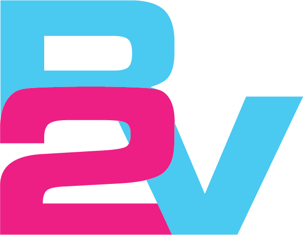

# R2V — Real to Virtual 3D Asset Platform

<p align="center">
  
</p>

<p align="center">
  <strong>AI-powered platform for generating, scanning, managing, and selling 3D assets.</strong>
</p>

<p align="center">
  
  
  
  
  
</p>

---

## Overview

**R2V (Real to Virtual)** is a full-stack graduation project that transforms ideas, prompts, and real-world object photos into usable 3D assets. The platform combines a premium Flutter Web interface, a FastAPI backend, asynchronous Celery workers, object storage, marketplace features, social interactions, payments, and AI/photogrammetry pipelines.

The main goal is to help creators, students, freelancers, game developers, AR/VR builders, and 3D artists quickly create, preview, publish, and monetize 3D models from text prompts, images, or photo scans.

---

## Core Features

### AI 3D Generation

* Text-to-3D generation through the AI Studio.
* Optional image-to-3D workflow for uploaded reference images.
* Stable Diffusion image generation/conditioning used as part of the AI concept-to-asset flow.
* Hunyuan3D-based mesh generation for producing 3D geometry.
* Optional Hunyuan3D-Paint / texture stage for textured assets.
* GLB output storage and secure download links.
* Background processing with Celery so long AI jobs do not block the API.
* Modal-hosted GPU API integration through configurable endpoints.

### Photogrammetry / Photo Scan

* Upload multiple object photos.
* Run a reconstruction pipeline using COLMAP and OpenMVS tooling.
* Produce 3D outputs such as GLB, OBJ, PLY, reports, masks, sparse/dense clouds, and texture outputs.
* Supports a vertex-color texture fallback mode for more reliable preview output.
* Publish completed photogrammetry outputs directly as marketplace assets.

### Marketplace

* Browse, search, preview, like, save, and download 3D assets.
* Publish user-created models as free or paid assets.
* Asset metadata includes category, style, tags, license, price, previews, and creator information.
* Stripe checkout integration for paid assets and subscriptions.

### Social Layer

* User profiles with avatar, bio, and creator information.
* Posts connected to assets.
* Likes, saves, followers, following, and notifications.
* Creator profile pages and public marketplace presence.

### Freelance Hub

* Freelancer discovery screen.
* Freelancer profiles with skills, rating, reviews, pricing, and featured status.
* Workspace UI for freelancer/client interaction.
* Dashboard-style analytics, wallet, orders, and milestones UI.

---

## AI Pipeline Used in R2V

R2V uses a multi-stage AI architecture. The heavy GPU runtime is expected to run separately, usually through a Modal-hosted FastAPI app, while the main backend communicates with it using HTTP.

```text
User prompt / uploaded image
        ↓
Prompt refinement / input preparation
        ↓
Stable Diffusion
        ↓
Generated concept image or conditioning image
        ↓
Hunyuan3D mesh generation
        ↓
Optional Hunyuan3D-Paint texture generation
        ↓
GLB model output
        ↓
Mesh repair / validation stage
        ↓
Upload to S3 or MinIO object storage
        ↓
Preview and download inside R2V
```

### AI Components

| Component                       | Purpose                                                                 |
| ------------------------------- | ----------------------------------------------------------------------- |
| Stable Diffusion                | Generates or conditions the visual reference used before 3D generation. |
| Hunyuan3D                       | Converts visual/text-guided input into a 3D mesh.                       |
| Hunyuan3D-Paint / texture stage | Adds texture/material detail when enabled.                              |
| Modal GPU API                   | Hosts the heavy AI model runtime outside the main backend.              |
| FastAPI backend adapter         | Sends prompt/image jobs to Modal and stores the resulting GLB.          |
| Celery worker                   | Runs long AI jobs asynchronously.                                       |
| MinIO/S3                        | Stores generated outputs and provides presigned download URLs.          |

> Important: large AI model weights, Hugging Face caches, Modal volumes, generated assets, and `.env` secrets should not be committed to GitHub.

---

## Tech Stack

### Frontend

* Flutter Web / Dart
* Material UI custom theme
* `model_viewer_plus` for 3D model preview
* `file_picker`, `image_picker`, and camera-related packages
* HTTP API service layer for backend integration
* Web/mobile-ready project structure

### Backend

* Python 3.12
* FastAPI
* SQLAlchemy 2
* Alembic migrations
* PostgreSQL
* Redis
* Celery
* MinIO / S3-compatible storage
* Stripe API
* JWT authentication
* Google OAuth configuration support

### AI & 3D Processing

* Stable Diffusion
* Hunyuan3D / Hunyuan3D-Paint
* Modal GPU deployment
* COLMAP
* OpenMVS
* Trimesh
* OpenCV
* Pillow
* NumPy / SciPy

---

## Quick Start

### Backend

```bash
cd backend
cp .env.example .env
docker compose up --build
```

Default backend URLs:

| Service       | URL                           |
| ------------- | ----------------------------- |
| FastAPI       | `http://localhost:18001`      |
| API Docs      | `http://localhost:18001/docs` |
| MinIO API     | `http://localhost:9000`       |
| MinIO Console | `http://localhost:9001`       |

### Frontend

```bash
cd frontend
flutter pub get
flutter run -d chrome --dart-define=R2V_API_BASE_URL=http://localhost:18001
```

### Production Flutter Build

```bash
flutter build web --release --dart-define=R2V_API_BASE_URL=https://your-api-domain.com
```

> `R2V_API_BASE_URL` is required in production so the frontend calls the API server instead of the static website origin.

---

## Repository Structure

```text
R2V/
├── backend/                         # FastAPI backend, DB models, Celery workers
├── frontend/                        # Flutter Web application
├── photogrammetry_pipeline_project/ # COLMAP/OpenMVS photo reconstruction pipeline
├── .github/workflows/               # CI/deployment workflow files
├── CHANGELOG.md
├── INTEGRATION_GUIDE.md
└── INTEGRATION_REPORT.md
```

---

## Important API Areas

| Area           | Main Routes                                                              |
| -------------- | ------------------------------------------------------------------------ |
| Auth           | `/auth/signup`, `/auth/login`, `/auth/refresh`, `/auth/logout`           |
| Verification   | `/auth/verify/request`, `/auth/verify/confirm`                           |
| Password Reset | `/auth/password/forgot`, `/auth/password/verify`, `/auth/password/reset` |
| Profile        | `/me`                                                                    |
| AI Jobs        | `/ai/jobs`, `/ai/jobs/{job_id}`, `/ai/jobs/{job_id}/download/glb`        |
| Legacy AI      | `/generate-from-text`                                                    |
| Scan Jobs      | `/scan/jobs`, `/scan/jobs/{job_id}/presign`, `/scan/jobs/{job_id}/start` |
| Photogrammetry | `/api/photogrammetry/jobs`                                               |
| Marketplace    | `/marketplace/assets`                                                    |
| Social         | `/social/posts`, `/social/follow/{user_id}`                              |
| Freelance      | `/freelance/profiles`, `/freelance/dashboard`                            |
| Billing        | `/billing/checkout/asset`, `/billing/checkout/subscription`              |
| Admin          | `/admin/summary`                                                         |
| Health         | `/health`                                                                |

---

## Project Status

R2V is an active graduation project and full-stack prototype. The repository includes the main Flutter frontend, FastAPI backend, storage/payment/authentication foundations, AI job adapters, and a photogrammetry package. The external GPU AI runtime is configured through Modal endpoints and should be deployed separately from the main application.

---

<p align="center">
  Built with Flutter, FastAPI, Stable Diffusion, Hunyuan3D, and a lot of 3D ambition.
</p>
